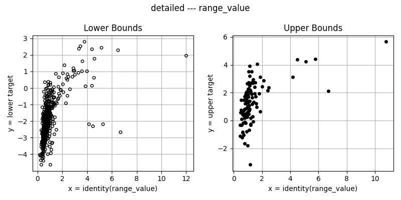
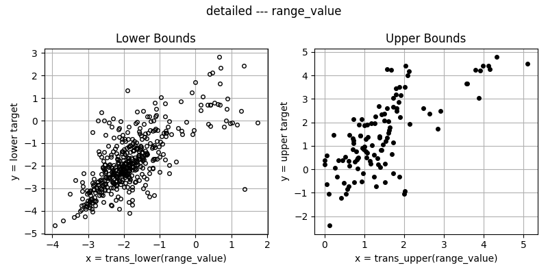

# Feature Transformation
## Overview
This document outlines the process of transforming features using importance scores from a Random Forest model and power regression. The purpose of this process is to enhance model performance by applying appropriate transformations to selected features.

## Process
### 1. Raw Features
Begin with a dataset that contains raw features. These are the initial variables used in the predictive modeling process.

### 2. Feature Importance
Calculate the importance of each feature using a Random Forest model. This step involves:
- **Training a Random Forest Model**: Fit a Random Forest model on your dataset.
- **Extracting Feature Importance**: Obtain the importance scores for each feature from the trained model.

### 3. Selecting Important Features
Based on the importance scores from the Random Forest model, identify the most significant features. This is done by:
- **Ranking Features**: Order features according to their importance scores.
- **Selecting Top Features**: Choose a subset of features based on their ranked importance.

### 4. Applying Power Regression
Transform the selected features using power regression [Power Regression](https://github.com/lamtung16/Power-Regression-Model).

### 5. Applying Transformations
Apply the selected transformation functions to the important features. This involves:
- **Choosing Transformation Functions**: Select appropriate functions from the list of power regression functions.
- **Transforming Features**: Apply the chosen functions to the selected features to obtain transformed features.

## Visualization
<table>
  <tr>
    <td>
      
    </td>
    <td style="text-align: center;">
      
    </td>
    <td>
      
    </td>
  </tr>
  <tr>
    <td style="text-align: center;">Identity Function</td>
    <td></td>
    <td style="text-align: center;">Power Transformation Function</td>
  </tr>
</table>

## Conclusion
This feature transformation process improves predictive model performance by selecting important features and applying power regression transformations. The Random Forest model guides feature selection, while power regression functions enhance feature representation.